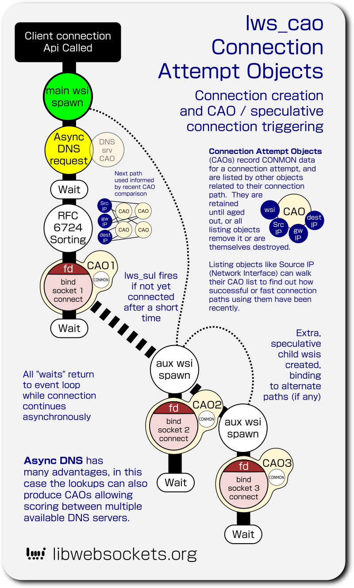
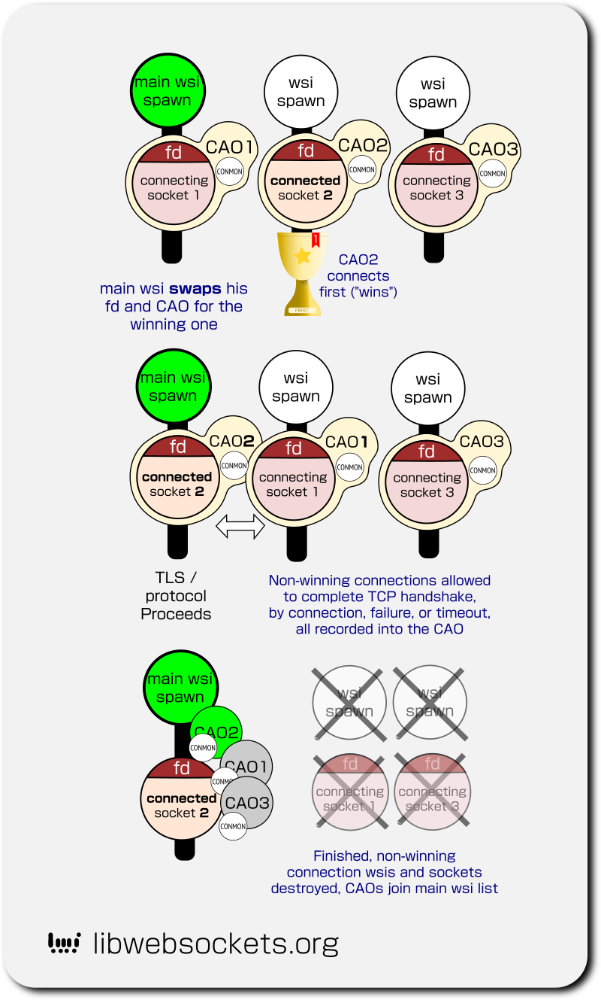

# lws_cao  Connection Attempt Objects

`lws_cao_t` are internal lws objects that act as entries in a multi-indexed
database of recent connection attempts, what path they took, and what the
results were.

Client network connections have at least one HEAD CAO that contains the network
socket desc and the related CONMON.  A client network connection wsi can get
additions "losing" CAOs from connection attempts that didn't "win" also attached
to the tail of its `cao_owner`.

CAOs contain CONMON information as well as additional members.

## Background

Multi-homed client devices have become very common, eg, Android phones may have
multiple network interfaces and handle a mix of ipv4 and ipv6, possibly with
multiple source addresses for each family.

At the same time, it's not uncommon for some of the options to be degraded or
nonfunctional, such as ipv6 local addresses that cannot route out to the
internet.

In order to understand the situation the client device finds itself in, which
may be changeable itself, client connections have to do more work to measure
what happens during connection attempts and remember it so it can make decisions
next time driven by what it has been observing.

That's the function of CAOs.

It's not enough to simplify the network topology at the client using blunt
instruments like "ipv4 vs ipv6", each network interface and path component like
a gateway has its own story.

## Connection flow

